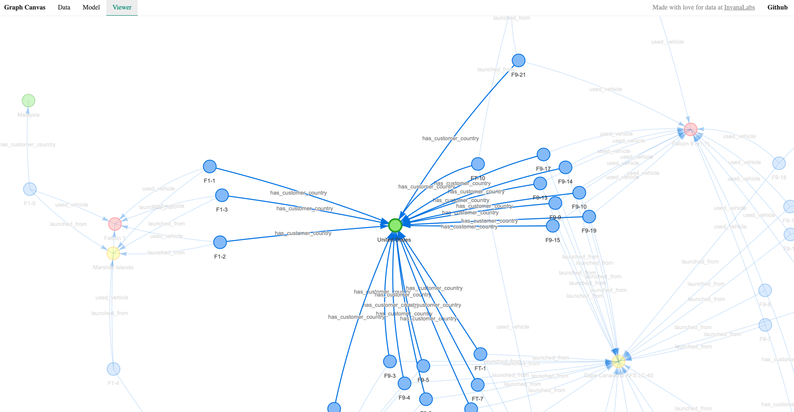
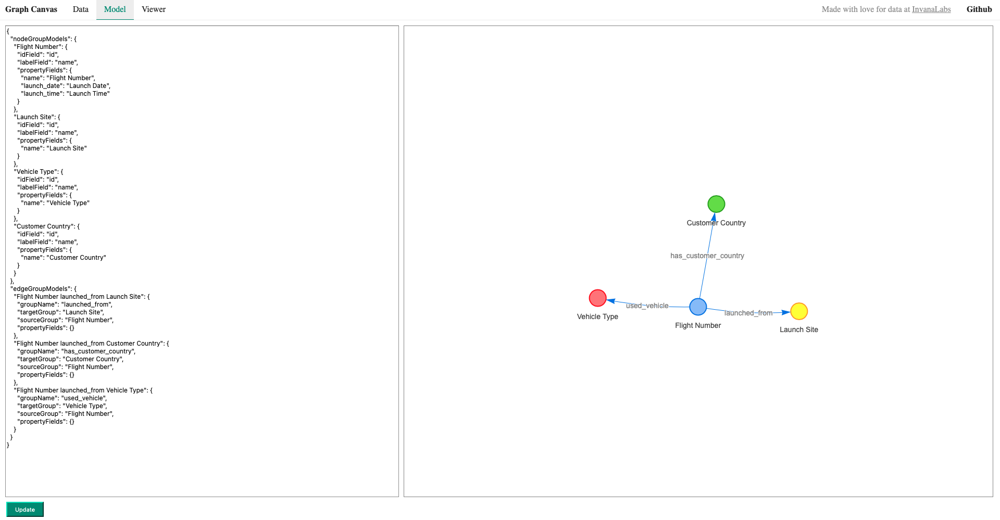
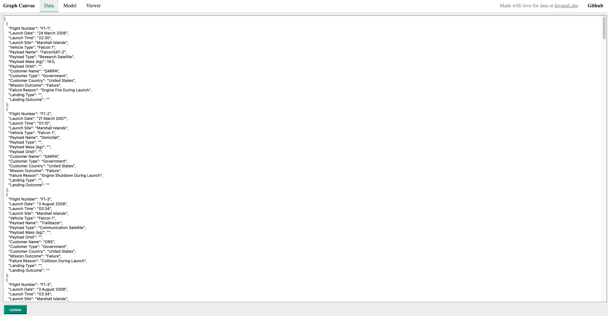

# graph-canvas

React UI components for creating beautiful network graphs based on [Vis.js](https://github.com/visjs/vis-network).

## Feature Checking 
 - [x] Draw network graph from JSON data
 - [x] model nodes and edges dynamically from JSON data.
 - [ ] modify display settings of nodes, edges.
 - [ ] View properties of a node/edge in the canvas
 - [ ] log events to track history of positions of elements in graph canvas
 - [ ] freeze positions of graph canvas

## Screenshots

\

